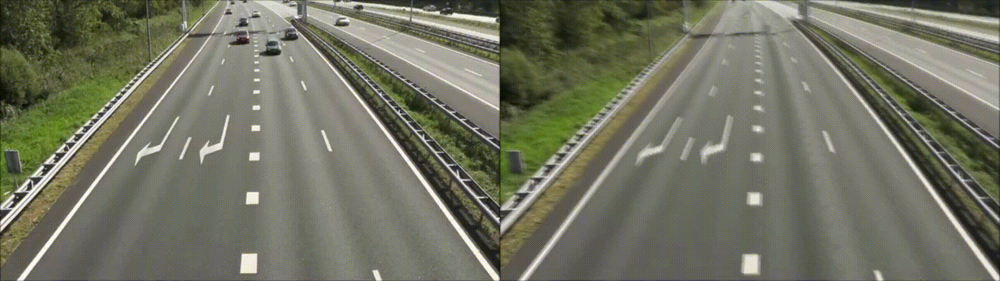

# Background Reconstruction Using ViBe

## Table of Contents

1. [Introduction](#1-introduction)
2. [Installation](#2-installation)
3. [How to Run](#3-how-to-run)
4. [Detailed Algorithm Explanation](#4-detailed-algorithm-explanation)


## 1. Introduction


### Motivation & Purpose

Background reconstruction is an important task in computer vision applications such as surveillance, scene monitoring, motion analysis, and static-object detection.

A conventional background subtraction algorithm can determine whether a pixel currently belongs to the **foreground** or **background**, but this alone does not provide a stable reconstructed image of the scene.

This project combines:

- **ViBe background subtraction**
- **Temporal static-pixel aging**
- **Exponential Moving Average (EMA) background reconstruction**

to gradually construct a stable background image from a video stream.

The system first uses **ViBe** to determine which pixels currently belong to the background. These classifications are then monitored over time. A pixel must remain continuously classified as background for a configurable number of frames before it is considered reliable enough to contribute to the reconstructed background.

The purpose of the system is to:

- Detect foreground regions using a sample-based background model.
- Prevent unstable or moving pixels from immediately modifying the reconstructed background.
- Track how long each pixel remains static.
- Gradually reconstruct a stable background using reliable pixels.
- Adapt the reconstructed background to gradual scene changes.

### High-Level Overview

The processing pipeline consists of three main stages:

1. **Video Streaming**
   - Reads frames from the configured video source.
   - Resizes frames to a consistent resolution.
   - Provides the initial frame for algorithm initialization.

2. **ViBe Background Subtraction**
   - Maintains multiple background samples for every pixel.
   - Compares the current frame against these samples.
   - Produces a binary foreground/background mask.
   - Continuously updates the background model using randomized sampling.

3. **Background Reconstruction**
   - Tracks how long each pixel remains classified as background.
   - Marks pixels as reliable after a configured temporal threshold.
   - Updates the reconstructed background using a dual-rate Exponential Moving Average.

The complete pipeline is:

```text
Video Input
    |
    v
VideoStreamer
    |
    v
Current Frame
    |
    v
ViBe Background Subtraction
    |
    v
Binary Foreground Mask
    |
    v
Static Pixel Aging
    |
    v
Reliable Background Pixels
    |
    v
EMA Background Reconstruction
    |
    v
Reconstructed Background
```

The binary mask uses the following representation:

```text
0   -> Background
255 -> Foreground
```


## 2. Installation

### Environment Setup

The project provides an automated development-environment setup. This project needs Python 3.11.

If you are using **Visual Studio Code**, the recommended installation procedure is:

1. Open the project in **VS Code**.

2. Open the Command Palette:

```text
Ctrl + Shift + P
```

3. Search for:

```text
Tasks: Run Task
```

4. Select:

```text
Install Dev Environment
```

5. VS Code will run the predefined installation task and configure the required development environment.

### VS Code Quick Setup

```text
Open Project
    |
    v
Ctrl + Shift + P
    |
    v
Tasks: Run Task
    |
    v
Install Dev Environment
    |
    v
Environment Ready
```

### Manual Environment Setup

If the development environment needs to be created manually, create a Python virtual environment:

```bash
python -m venv venv
```

Activate the environment.

#### Linux / macOS

```bash
source venv/bin/activate
```

#### Windows

```bash
venv\Scripts\activate
```


## 3. How to Run

The application is executed through the main Python entry point.

### Basic Usage

Run the application using:

```bash
python app/main.py --configuration_file_path configuration_files/configuration_1.yml
```

The application accepts:

```text
--configuration_file_path
```

to specify the YAML configuration file.

The default configuration path defined by the implementation is:

```text
configuration_files/configuration_1.yml
```


### Runtime Sequence

When the application starts, it performs the following steps:

```text
Read Configuration
        |
        v
Initialize VideoStreamer
        |
        v
Read Calibration Frame
        |
        +------------------------+
        |                        |
        v                        v
Initialize ViBe       Initialize Background
                         Reconstructor
        |                        |
        +------------+-----------+
                     |
                     v
              Process Frames
```

The first frame of the video is used as the **calibration frame**.

This frame is used to initialize:

- the ViBe history model,
- the dimensions of the background reconstructor.

The main processing loop is conceptually:

```python
for frame_id, frame in streamer.stream():

    binary_mask = vibe(frame)

    reconstructed_background = background_reconstructor(
        frame,
        binary_mask
    )

    streamer.display(
        frame,
        reconstructed_background
    )
```

### Video Resolution

Every successfully decoded frame is resized to:

```text
720 x 720
```

before it is passed to ViBe and the background reconstructor.

### Keyboard Controls

Press:

```text
q
```

to close the application.

Press:

```text
Space
```

to print the current frame ID:

```text
[INFO] Frame ID: 125
```


## 4. Detailed Algorithm Explanation

### 4.1 Overall Algorithm

The system combines two main computer-vision algorithms:

1. **ViBe Background Subtraction**
2. **Static-Pixel-Based Background Reconstruction**

Conceptually:

```text
I_t
 |
 v
ViBe
 |
 v
M_t
 |
 v
Static Pixel Aging
 |
 v
R_t
 |
 v
EMA Update
 |
 v
B_t
```

where:

```text
I_t = Current input frame

M_t = Foreground/background mask

R_t = Reliable static-pixel mask

B_t = Reconstructed background
```


### 4.2 Background Subtraction — ViBe

#### Idea

ViBe is a **sample-based background subtraction algorithm**.

Instead of representing each background pixel using one value, ViBe maintains a collection of possible background values for every pixel.

For pixel `x`, the background model is:

```text
S(x) =
{
    S_1(x),
    S_2(x),
    ...
    S_N(x)
}
```

where:

```text
N = number_of_samples
```

The default value in the implementation is:

```text
number_of_samples = 30
```

Therefore, every pixel has multiple historical samples describing its possible background appearance.

#### Why Use Multiple Samples?

Real backgrounds are rarely perfectly constant.

Pixel values can vary because of:

- camera sensor noise,
- small illumination changes,
- compression artifacts,
- minor environmental variation.

Using several background samples allows ViBe to represent this variation without requiring a single exact background value.


### 4.3 ViBe Initialization

The first video frame is used as the calibration frame.

The ViBe history buffer has the conceptual shape:

```text
Channels x Height x Width x NumberOfSamples
```

For an RGB frame with 30 samples:

```text
3 x H x W x 30
```

For the resized video frames:

```text
3 x 720 x 720 x 30
```

The first samples are initialized directly from the calibration frame.

With the default:

```text
matching_number = 2
```

the first two samples contain the original calibration-frame value.

The remaining samples are generated by adding random noise:

```text
sample =
calibration_pixel + random_noise
```

The generated random noise is approximately:

```text
[-20, 20)
```

Values are clipped to:

```text
0 ... 255
```

Example:

```text
Calibration Pixel:

[120, 100, 80]

Possible ViBe Samples:

[120, 100, 80]
[120, 100, 80]
[115, 106, 75]
[128, 94, 88]
[111, 102, 91]
...
```

This creates an initial distribution around the observed background pixel.


### 4.4 Pixel Matching

For every incoming frame, the current pixel is compared against every sample stored for the same pixel position.

For a current pixel:

```text
I_t(x)
```

and a stored sample:

```text
S_i(x)
```

the implementation calculates an RGB L1-style distance:

```text
d(I_t(x), S_i(x))
=
|R_t - R_i|
+
|G_t - G_i|
+
|B_t - B_i|
```

A stored sample is considered a match when:

```text
distance <= effective threshold
```

The effective threshold used by the implementation is:

```text
effective_threshold
=
4.5 * matching_threshold
```

The default configuration uses:

```text
matching_threshold = 10
```

therefore:

```text
effective_threshold = 45
```


### 4.5 Foreground / Background Classification

After comparing the current pixel against all stored samples, ViBe counts the number of matching samples.

The configured parameter:

```text
matching_number
```

defines the minimum number of required matches.

The default value is:

```text
matching_number = 2
```

The classification rule is:

```text
if number_of_matches >= matching_number:

    BACKGROUND

else:

    FOREGROUND
```

Conceptually:

```text
Current Pixel
     |
     v
Compare With N Samples
     |
     v
Count Matches
     |
 +---+-------------------+
 |                       |
 v                       v

Matches >= M        Matches < M
     |                       |
     v                       v

BACKGROUND             FOREGROUND
```

Internally, ViBe represents the segmentation as:

```text
0 -> Background
1 -> Foreground
```

Before returning the mask to the rest of the application, it is converted to:

```text
0   -> Background
255 -> Foreground
```


### 4.6 ViBe Model Update

#### Idea

The ViBe model must adapt gradually as the appearance of the scene changes.

However, updating every pixel on every frame would cause the model to adapt too aggressively.

ViBe therefore uses a **stochastic update mechanism**.

The parameter:

```text
update_factor
```

controls the probability of selecting background pixels for model updates.

Conceptually:

```text
P(update)
≈
1 / update_factor
```

Only pixels currently classified as **background** are eligible for these updates.


### 4.7 Preventing Foreground Updates

The implementation effectively performs:

```text
update =
random_update_mask * (1 - foreground_mask)
```

For a background pixel:

```text
foreground_mask = 0
```

therefore:

```text
1 - 0 = 1
```

and the pixel may update the model.

For a foreground pixel:

```text
foreground_mask = 1
```

therefore:

```text
1 - 1 = 0
```

and no model update occurs.

Conceptually:

```text
Pixel Classification
        |
   +----+----+
   |         |
   v         v

Background  Foreground
   |         |
   v         v

May Update   Do Not Update
```

This prevents newly detected foreground objects from immediately contaminating the ViBe background model.


### 4.8 Random Sample Replacement

When a background pixel is selected for updating, ViBe selects one sample position randomly.

For example:

```text
Background Samples:

S_0
S_1
S_2
...
S_17  <- randomly selected
...
S_29
```

The selected sample is replaced by the current pixel:

```text
S_17(x) = I_t(x)
```

More generally:

```text
S_k(x) = I_t(x)
```

where:

```text
k
```

is a randomly selected history position.

This lets the background model adapt gradually rather than replacing the entire model at once.


### 4.9 Neighbor Propagation

ViBe also performs a spatial update.

When a background pixel is selected, its current value can be inserted into the background model of a neighboring pixel.

The neighborhood is controlled by:

```text
neighborhood_radius
```

The default value is:

```text
neighborhood_radius = 1
```

Possible neighboring positions therefore include:

```text
(x-1, y-1)   (x-1, y)   (x-1, y+1)

(x,   y-1)   (x,   y)   (x,   y+1)

(x+1, y-1)   (x+1, y)   (x+1, y+1)
```

Coordinates outside the image are clipped to the valid image boundaries.

Conceptually:

```text
Current Background Pixel
          |
          +-------------------+
          |                   |
          v                   v
Update Own Model      Update Neighbor Model
          |                   |
          v                   v
Random Sample         Random Sample
Replacement           Replacement
```

This allows local background information to propagate spatially.


### 4.10 Foreground Mask Post-Processing

The raw ViBe mask can contain:

- isolated noisy pixels,
- fragmented foreground regions,
- small holes,
- unstable boundaries.

The implementation therefore cleans the segmentation mask using:

```text
Raw ViBe Mask
      |
      v
Median Filter
      |
      v
Morphological Opening
      |
      v
Morphological Closing
      |
      v
Binary Threshold
      |
      v
Final Binary Mask
```

#### Median Filtering

The median filter removes isolated local noise.

The default kernel size is:

```text
3
```

#### Morphological Opening

Opening consists of:

```text
Erosion
   |
   v
Dilation
```

It is mainly used to remove small foreground noise.

#### Morphological Closing

Closing consists of:

```text
Dilation
   |
   v
Erosion
```

It helps:

- fill small holes,
- connect nearby foreground regions,
- produce more coherent masks.

The morphological operations use an elliptical structuring element.


### 4.11 Background Reconstruction

#### Idea

The binary mask generated by ViBe does not directly update the reconstructed background.

A pixel may temporarily be classified as background because of noise or model adaptation.

The reconstructor therefore requires a pixel to remain classified as background for a configurable number of consecutive frames before trusting it.

The main concept is:

```text
ViBe says "background"
        |
        v
Wait for temporal stability
        |
        v
Pixel becomes reliable
        |
        v
Update reconstructed background
```


### 4.12 Static Pixel Aging

The reconstructor maintains:

```text
static_pixel_duration_map
```

with one counter for every pixel.

For each frame:

```text
is_static = binary_mask == 0
```

If the pixel is background:

```text
D_t(x)
=
D_(t-1)(x) + 1
```

If the pixel is foreground:

```text
D_t(x)
=
0
```

where:

```text
D_t(x)
```

is the number of consecutive frames that pixel `x` has remained classified as background.

Example:

```text
Classification:

BG  BG  BG  BG  FG  BG  BG
```

produces:

```text
Static Duration:

1   2   3   4   0   1   2
```

Therefore, even one foreground classification resets the temporal history for that pixel.


### 4.13 Reliable Static Pixels

The parameter:

```text
age_threshold
```

determines how long a pixel must remain static before it is trusted.

The default value defined by the implementation is:

```text
age_threshold = 5
```

A pixel becomes reliable when:

```text
static_duration >= age_threshold
```

Mathematically:

```text
R_t(x) =
{
    1, if D_t(x) >= age_threshold
    0, otherwise
}
```

Example:

```text
age_threshold = 5
```

```text
Duration 1 -> Not Reliable
Duration 2 -> Not Reliable
Duration 3 -> Not Reliable
Duration 4 -> Not Reliable
Duration 5 -> Reliable
Duration 6 -> Reliable
...
```

The reason for this temporal check is to avoid immediately trusting unstable classifications.

---

### 4.14 Newly Reliable Pixels

The reconstructor separately detects pixels whose static duration has exactly reached the threshold:

```text
just_became_reliable
=
static_duration == age_threshold
```

This separates reliable pixels into:

```text
Newly Reliable Pixels

and

Long-Term Reliable Pixels
```

The distinction allows different EMA learning rates to be used.


### 4.15 Exponential Moving Average Background Update

Once a pixel is reliable, the reconstructed background is updated using an **Exponential Moving Average (EMA)**.

The update equation is:

```text
B_t(x)
=
(1 - alpha) * B_(t-1)(x)
+
alpha * I_t(x)
```

where:

```text
B_t(x)
    Updated reconstructed background

B_(t-1)(x)
    Previous reconstructed background

I_t(x)
    Current frame pixel

alpha
    Background learning rate
```

For example:

```text
Previous Background = 100

Current Pixel = 120

alpha = 0.02
```

Then:

```text
B_t
=
(1 - 0.02) * 100
+
0.02 * 120
```

```text
B_t
=
98 + 2.4
```

```text
B_t = 100.4
```

The background therefore changes gradually instead of immediately copying the current frame.


### 4.16 Dual-Rate EMA

The background reconstructor uses two learning rates:

```text
background_change_ratio
```

and:

```text
foreground_change_ratio
```

The default values are:

```text
background_change_ratio = 0.02

foreground_change_ratio = 0.01
```

Newly reliable pixels use:

```text
alpha = foreground_change_ratio
```

while already established reliable pixels use:

```text
alpha = background_change_ratio
```

Conceptually:

```text
Reliable Pixel
      |
      v
Just Became Reliable?
      |
 +----+----+
 |         |
Yes        No
 |         |
 v         v
0.01      0.02
```

This allows newly accepted pixels to enter the background conservatively while established background regions adapt slightly faster.


### 4.17 Background Initialization

The reconstructed background is initialized as a floating-point image containing zeros:

```text
B_0(x) = 0
```

Therefore, the initial reconstructed background is black.

Once pixels become reliable, EMA updates gradually move the background toward the observed pixel values.

For example:

```text
Current Pixel = 200

Initial Background = 0

alpha = 0.01
```

The first update is:

```text
B_1
=
0.99 * 0
+
0.01 * 200
```

```text
B_1 = 2
```

Repeated updates gradually converge toward the observed background value.


### 4.18 Moving Object Behavior

Consider an object moving through the scene.

While the object is moving:

```text
Object Appears
      |
      v
ViBe Detects Foreground
      |
      v
Mask = 255
      |
      v
Static Duration = 0
      |
      v
No Background Reconstruction Update
```

This prevents moving objects from immediately appearing in the reconstructed background.


### 4.19 Object Leaves the Scene

When the moving object leaves, the physical background becomes visible again.

The sequence becomes:

```text
Background Visible Again
        |
        v
ViBe = Background
        |
        v
Static Duration = 1
        |
        v
Static Duration = 2
        |
        v
...
        |
        v
Age Threshold Reached
        |
        v
Reliable Background Pixel
        |
        v
EMA Update
```

The reconstructed background is then gradually restored.


### 4.20 Stationary Foreground Objects

One important behavior of this system is that ViBe is adaptive.

Suppose an object enters the scene and then remains stationary.

Initially:

```text
Object Appears
      |
      v
ViBe = Foreground
      |
      v
Excluded From Reconstruction
```

If the object remains stationary long enough, the adaptive ViBe model may eventually classify its pixels as background.

The sequence can then become:

```text
Stationary Object
      |
      v
ViBe Model Adapts
      |
      v
Object Becomes Background
      |
      v
Static Duration Increases
      |
      v
Age Threshold Reached
      |
      v
Object Pixels Become Reliable
      |
      v
EMA Reconstruction
```

Therefore, the current implementation primarily models:

```text
Temporal Pixel Stability
```

rather than explicitly determining:

```text
True Physical Background
```

This behavior should be considered when using the reconstructed background in later static-object-detection stages.


### 4.21 Static Duration Counter

The static-duration map is stored as:

```text
uint8
```

which supports values from:

```text
0 ... 255
```

The implementation continuously increments background pixels:

```text
duration += 1
```

For long video sequences, a saturating counter would provide safer behavior:

```text
D_t(x)
=
min(
    D_(t-1)(x) + 1,
    maximum_duration
)
```

This prevents the counter from exceeding the useful numerical range of its storage type.


### 4.22 Complete Algorithm

The complete algorithm can be summarized as:

```text
INITIALIZATION
==============

1. Read the application configuration.

2. Open the configured video source.

3. Read the first frame as the calibration frame.

4. Initialize the ViBe history model.

5. Initialize the reconstructed background.

6. Initialize the static-pixel duration map.


FOR EACH FRAME
==============

1. Read the next video frame.

2. Resize the frame to 720 x 720.

3. Convert the frame to a PyTorch tensor.

4. Compare every pixel with all stored ViBe samples.

5. Calculate the RGB difference for every sample.

6. Count the number of matching samples.

7. If enough samples match:

       classify pixel as BACKGROUND

   otherwise:

       classify pixel as FOREGROUND

8. Select eligible background pixels using the
   randomized ViBe update mask.

9. Replace a random historical sample with the
   current background pixel.

10. Propagate selected values into neighboring
    pixel models.

11. Convert the segmentation mask back to NumPy.

12. Convert the mask to:

       0   = Background
       255 = Foreground

13. Apply median filtering.

14. Apply morphological opening.

15. Apply morphological closing.

16. Apply final binary thresholding.

17. Pass the cleaned mask into the
    BackgroundReconstructor.

18. Determine static pixels:

       static = mask == 0

19. Increment the duration of static pixels.

20. Reset foreground-pixel durations to zero.

21. Determine reliable pixels:

       duration >= age_threshold

22. Determine pixels that just reached the
    age threshold.

23. Create an EMA learning-rate map.

24. Use foreground_change_ratio for newly
    reliable pixels.

25. Use background_change_ratio for established
    reliable pixels.

26. Update reliable reconstructed-background pixels:

       B_t
       =
       (1 - alpha) * B_(t-1)
       +
       alpha * I_t

27. Convert the reconstructed background to uint8.

28. Display the original frame and reconstructed
    background.

29. Continue until the video ends or the
    application is terminated.
```

### Algorithm Summary

The complete system can be expressed as:

```text
Sample-Based Background Modeling
                +
Pixel-to-Sample Matching
                +
Foreground Segmentation
                +
Stochastic Model Updating
                +
Spatial Neighbor Propagation
                +
Morphological Mask Cleaning
                +
Temporal Static-Pixel Aging
                +
Reliable Pixel Selection
                +
Dual-Rate EMA Reconstruction
```

Mathematically:

```text
M_t = ViBe(I_t, S_t)
```

followed by:

```text
D_t(x)
=
D_(t-1)(x) + 1
```

when:

```text
M_t(x) = Background
```

and:

```text
D_t(x) = 0
```

when:

```text
M_t(x) = Foreground
```

The reliable-background condition is:

```text
R_t(x)
=
D_t(x) >= age_threshold
```

and the final background reconstruction is:

```text
B_t(x)
=
(1 - alpha(x)) * B_(t-1)(x)
+
alpha(x) * I_t(x)
```

for reliable pixels.

The result is a background reconstruction pipeline that combines **sample-based foreground segmentation** with **temporal reliability checking** and **gradual background adaptation**.


# EXAMPLE OUTPUTS




